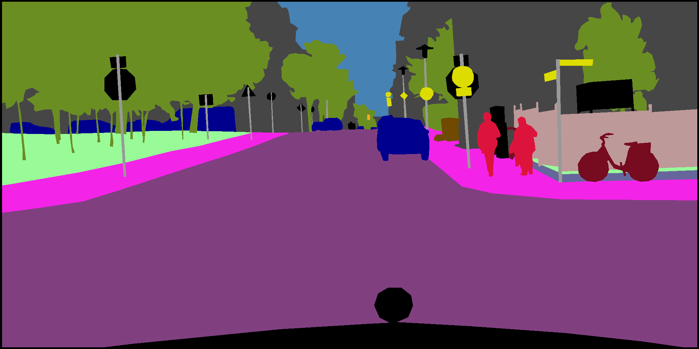
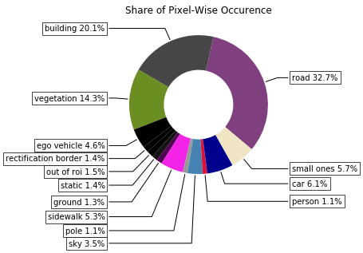
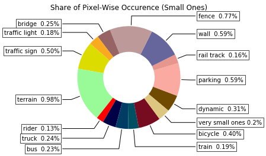
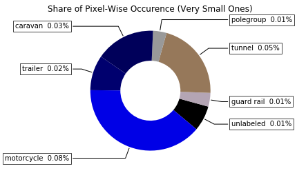
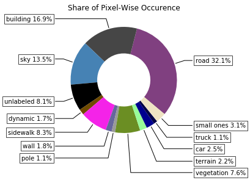
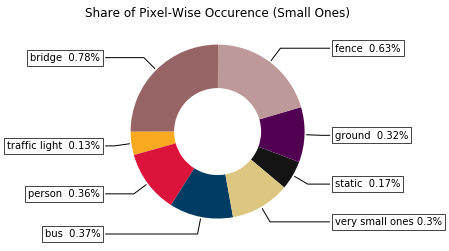
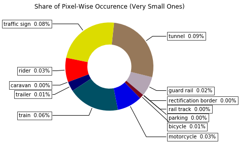
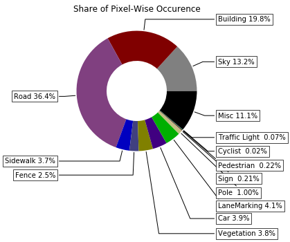
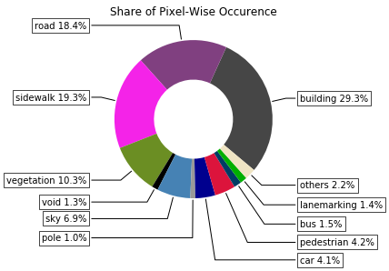
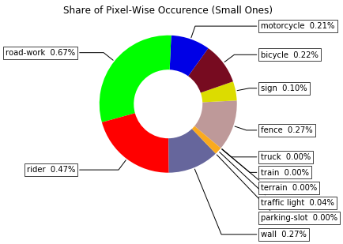

# Datasets for Autonomous Driving with Segmentation Labels

List of datsets with image segmentation labels. For more detailed information on individual datasets, see other files. _Cityscapes_, _CamVid_, _Kitti_, _Berkely DeepDrive_, _Playing for Data_ and _SynScapes_ have the same annotation guideline.

Segmentation image taken from the [Cityscapes dataset](https://www.cityscapes-dataset.com/).

| Name                    | Annotated Images | Instances | Label Type     | Domain    | License                                                | Web                                                                                  |
| ----------------------- | ---------------- | --------- | -------------- | --------- | ------------------------------------------------------ | ------------------------------------------------------------------------------------ |
| Audi A2D2               | 41,280           | x**       | RGB            | Real      | CC BY-ND 4.0                                           | [link](https://www.a2d2.audi/a2d2/en.html)                                           |
| Cityscapes              | 3,475*           | x         | RGB, grayscale | Real      | [license](https://www.cityscapes-dataset.com/license/) | [link](https://www.cityscapes-dataset.com/)                                          |
| CamVid                  | 701              |           | RGB            | Real      |                                                        | [link](http://mi.eng.cam.ac.uk/research/projects/VideoRec/CamVid/)                   |
| Synthia Sequences       | 31.927‬         | x         | RGB, grayscale | Synthetic | CC BY-NC-SA 3.0                                        | [link](https://synthia-dataset.net/)                                                 |
| Synthia Rand            | 13,407           |           | RGB            | Synthetic | CC BY-NC-SA 3.0                                        | [link](https://synthia-dataset.net/)                                                 |
| Synthia Rand Cityscapes | 9,400            | x         | RGB, grayscale | Synthetic | CC BY-NC-SA 3.0                                        | [link](https://synthia-dataset.net/)                                                 |
| Playing for Data        | 24,966           |           | RGB            | Synthetic |                                                        | [link](https://download.visinf.tu-darmstadt.de/data/from_games/)                     |
| SynScapes               | 25,000           | x         | grayscale      | Synthetic | [license](https://7dlabs.com/synscapes-license)        | [link](https://7dlabs.com/synscapes-overview)                                        |
| Kitti                   | 400              | x         | RGB, grayscale | Real      | CC BY-NC-SA 3.0                                        | [link](http://www.cvlibs.net/datasets/kitti/eval_semseg.php?benchmark=semantics2015) |
| ApolloScape             | 146,997          | x***      | RGB            | Real      | [license](http://apolloscape.auto/license.html)        | [link](http://apolloscape.auto/scene.html#)                                          |
| Berkeley DeepDrive      | 10,000           | x         | RGB, grayscale | Real      |                                                        | [link](https://bdd-data.berkeley.edu/)                                               |

*20,000 weak annotations in addition

**up to three different colors for instances of the same class

***For a subset of 74,555 frames

## Share of Class Labels in Total Datasets

__Cityscapes__

__Playing for Data__

__Synthia Sequences__

__Synthia Rand Cityscapes__

__Synthia Rand__
